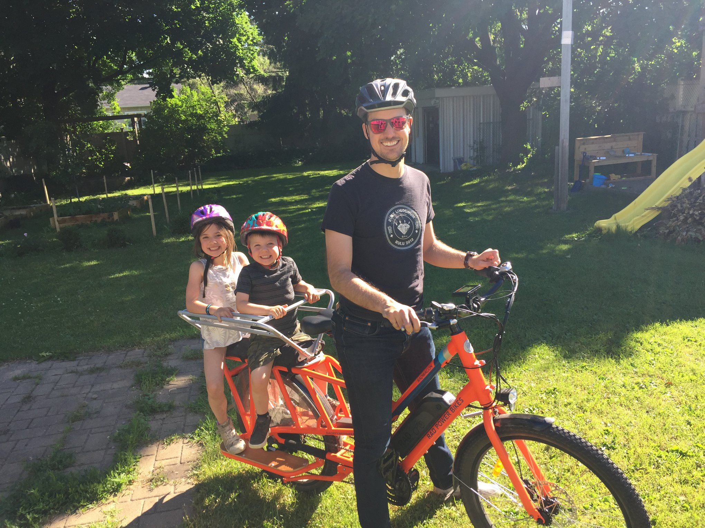

# Jevin's README for colleagues

I used to be a big fan of READMEs. The idea sounds great: make a doc so other people can understand you and work with you the way you want. I no longer find them as useful for two reasons:
* As I grow as a person, I've learned that figuring out how to work with each other needs to be done in the context of the relationship, it's important we adapt to the needs that we each have as individuals.
* The way we describe outselves are quite biased and often idealized. 

The "Random things about me" below is the only thing you can really trust. :D :D 

## A few random things about me

* I'm born on Christmas day.
* I have 3 kids and I'm married to a lovely gal (Ashley)
* I regularly host [House Concerts for the neighbourhood (video)](https://fb.watch/3KekGIjEpU/) (pre-Covid)
* I've been PC gaming since I was 7 (32 years!).
* I have developed moderate anxiety since 2016. It is mostly activated when I feel a sense of loss of control.
* I discovered in Sept 2021 that I also have ADHD which was the root of my anxiety this whole time. My medication has been life changing
* Urban biking is one of my favourite pass times.
* I've been consulting since 2010 with some stints in early startups (employee or cofounder).
* I'm allergic to pretty much all animals and the entire outdoors.
* I really enjoy [amateur radio](https://www.qrz.com/db/VA3JEV) and I'm now talking to people around the world with Morse code.
* I'm pretty geeky: I run Linux NixOS (deterministic configs for the win!) on my personal machine and have a Kubernetes Homelab with 7 PIs and 1 PC. 
* I'm quite informal yet professional. I can be overly silly/quirky and I'm working on toning that down.
* I'm a huge music buff and I have something playing all the time. My favorite stuff is usually Melodic Trance, Progressive House and Cocktail/Louge Jazz.

## What energizes me

* I really love positive and negative feedback. As a data person, it's really one of the best ways to know how I'm doing as a manager and employee. Give me as much feedback as you can.
* Getting everyone on the same page.
* Having a plan to get unstuck.
* Building clear stated expectations of me from both by direct reports and my supervisor.
* Metrics so we know how to improve.
* Creative solutions to solve problems.
* Making something manual and laborious into a system and a process.

## One one Ones (1o1s)

* I started doing 1o1s in 2016, and I saw how incredibly powerful they were for accelerating rapport and trust in relationships for both people.
* If you're skeptical about 1:1s, this is the process I follow. [the research shows they have incredible ROI](https://www.slideshare.net/evanish/everything-you-need-to-know-about-1-on-1s-to-prevent-turnover-and-motivate-your-team).

If you're a manager or employee I'll be overseeing, [please read this article, even if you've done 1o1s before](https://getlighthouse.com/blog/one-on-ones-employee-know/)
Key points:
* They are for you to grow and for us to learn how to work together better
* 1o1s are not for status updates or organizing work unless you want to talk about those

[^1]: https://www.researchgate.net/publication/281452089_Gossip_in_Organizations

[^2]: https://www.researchgate.net/publication/247738351_Gossip_in_Organizations_Contexts_Consequences_and_Controversies
